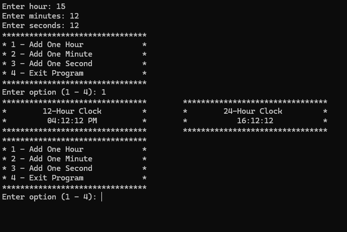

# Chada Tech Clock

A simple clock application that display an input time in both 12-hour and 24-hour format.

This project does not use the system clock.



## How to run

1. Download and install <a href="https://cmake.org/download/" target="_blank">CMake</a> and <a href="https://git-scm.com/install/windows" target="_blank">Git</a> if you don't have it installed.

2. Generate project files using

    ```bash
        cmake -B build
    ```

3. Run the build using commandline
    ```bash
        cmake --build build
        ./build/Debug/ChadaTechClock.exe # To Run the playground
    ```
    OR
    Run it in Visual Studio or your IDE of choice `(build/ChadaTechClock.slnx)`.
